# PilotGo-plugin-MFD

## Project Overview

### Project Name

Linux System Physical Memory Fragmentation Visualization Monitoring Tool

### Project Description

This project primarily develops a visualization monitoring tool for physical memory fragmentation in Linux systems, aimed at monitoring and recording the degree of physical memory fragmentation in the currently running system. 

The main features of this project include:

- Periodically collecting information on the degree of physical memory fragmentation in the current system environment, with configurable intervals;

- Recording data on memory fragmentation;

- Using a visualization tool to intuitively display the collected physical memory fragmentation information.

### Project Development Technologies

 - Kernel Space: eBPF
 - User Space: Python

 This project is mainly developed based on [BCC](https://github.com/iovisor/bcc), utilizing eBPF in kernel space and Python in user space.


# BCC Environment Setup

This project is developed based on BCC, so it requires the installation of the BCC environment. For detailed instructions, refer to the [documentation](https://github.com/iovisor/bcc/blob/master/INSTALL.md). Here, I will introduce how to configure the BCC environment on Ubuntu and OpenEuler.

## Ubuntu

Generally, to use these features, you need a Linux kernel version of 4.1 or higher. You can check your kernel version with` uname -r`.

<div align=center>
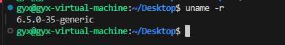
</div>


- OS : Ubuntu 22.04
- Kernel: Linux 6.5

### Update System Packages

```
sudo apt update
```

###  Install Build Dependencies

Choose based on your version of Ubuntu.

```
# For Focal (20.04.1 LTS)
sudo apt install -y zip bison build-essential cmake flex git libedit-dev \
  libllvm12 llvm-12-dev libclang-12-dev python zlib1g-dev libelf-dev libfl-dev python3-setuptools \
  liblzma-dev arping netperf iperf

# For Hirsute (21.04) or Impish (21.10)
sudo apt install -y zip bison build-essential cmake flex git libedit-dev \
  libllvm12 llvm-12-dev libclang-12-dev python3 zlib1g-dev libelf-dev libfl-dev python3-setuptools \
  liblzma-dev arping netperf iperf

# For Jammy (22.04)
sudo apt install -y zip bison build-essential cmake flex git libedit-dev \
  libllvm14 llvm-14-dev libclang-14-dev python3 zlib1g-dev libelf-dev libfl-dev python3-setuptools \
  liblzma-dev libdebuginfod-dev arping netperf iperf
  
# For Lunar Lobster (23.04)
sudo apt install -y zip bison build-essential cmake flex git libedit-dev \
  libllvm15 llvm-15-dev libclang-15-dev python3 zlib1g-dev libelf-dev libfl-dev python3-setuptools \
  liblzma-dev libdebuginfod-dev arping netperf iperf libpolly-15-dev

# For Mantic Minotaur (23.10)
sudo apt install -y zip bison build-essential cmake flex git libedit-dev \
  libllvm16 llvm-16-dev libclang-16-dev python3 zlib1g-dev libelf-dev libfl-dev python3-setuptools \
  liblzma-dev libdebuginfod-dev arping netperf iperf libpolly-16-dev

# For other versions
sudo apt-get -y install zip bison build-essential cmake flex git libedit-dev \
  libllvm3.7 llvm-3.7-dev libclang-3.7-dev python zlib1g-dev libelf-dev python3-setuptools \
  liblzma-dev arping netperf iperf

# For Lua support
sudo apt-get -y install luajit luajit-5.1-dev
```

### Install and Compile BCC

```
git clone https://github.com/iovisor/bcc.git
mkdir bcc/build; cd bcc/build
cmake ..
make
sudo make install
cmake -DPYTHON_CMD=python3 .. # build python3 binding
pushd src/python/
make
sudo make install
popd
```

### Common Issues

 `No module named 'setuptools'`

Solution: The setuptools module is not installed by default in Python. Install it using `sudo apt-get install python3-setuptools`.

### Test if Installation is Successful

```
cd bcc/tools
ls
```

Run ` ls` to see many Python files, then execute `sudo python3 biolatency.py`. If it runs successfully, the environment is configured correctly.

<div align=center>
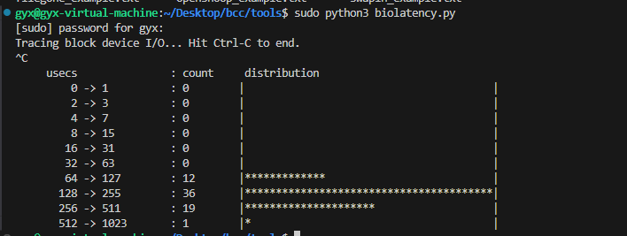
</div>


##  OpenEuler


### Pre-installed package

When installing the openEuler system, it is best to select "Software selection ==> Additional software for the selected environment ==> development tools", which will save the installation of many development tools, such as git, python3 and so on.

** If not checked, we can install the corresponding development tool by the following command: **

```
sudo  dnf install git -y
sudo dnf update
sudo dnf install python3 python3-pip
```
## Configuring BCC on OpenEuler

Generally, to use these features, you need a Linux kernel version of 4.1 or higher. You can check your kernel version with `uname -r`.

<div align=center>

</div>


- OS : openeuler 23.04
- Kernel: Linux 6.6

### Update and Install Packages

Run the command.
```
sudo dnf update
sudo dnf install bcc
```
These two commands update the packages and will automatically install the related environment and tools for BCC development, such as `bpf-tools, python3-bpfcc, llvm-libs, clang-libs`.

<div align=center>
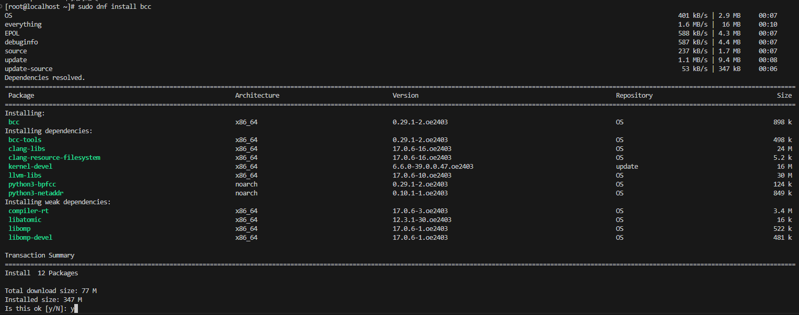
</div>

<div align=center>
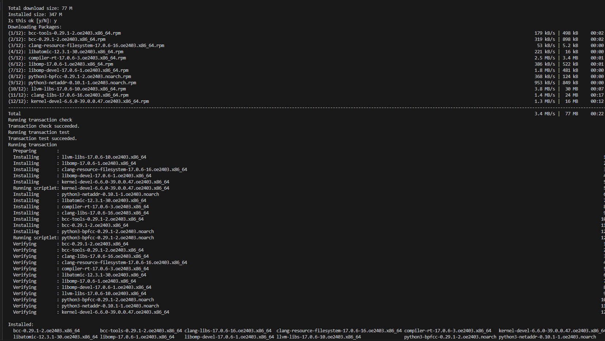
</div>


### Error Record

After installation, we enter the default installation directory /usr/share/bcc and see a folder named tools. When entering this folder with `cd /usr/share/bcc/tools` and running a binary file with sudo, we encounter an error. To resolve this, we need to execute` sudo dnf install kernel-devel-$(uname -r)` to install the development package for the currently running kernel version.

<div align=center>

</div>

After that, Run `sudo ./execsnoop`again. The terminal output data, as shown in the following figure, shows that the bcc environment is configured using a software package.

<div align=center>

</div>

# Usage Instructions
## Clone Repository

In the OpenEuler environment, the process is similar to that in Ubuntu. Here’s how to use the memory fragmentation tool in the OpenEuler environment.

Clone the project code to your local machine using:

```
git clone git@gitee.com:gyxforeveryoung/PilotGo-plugin-MFD.git
```
Then, navigate into the PilotGo-plugin-MFD directory.


## Code Structure

```
.
├── img
├── README.en.md
├── README.md
└── src
    ├── bpf
    │   ├── extfraginfo.c
    │   └── fraginfo.c
    ├── extfrag.py
    ├── extfrag_user.py
    └── __pycache__
        └── extfrag.cpython-311.pyc
```

- `extfrag.py` : used to implement the function of extracting data in the corresponding format.

- `extfrag_user.py` : This file implements the command-line interface.
- `extfraginfo.c`:  Implements monitoring of external fragmentation events.

- `fraginfo.c` : Collects statistics on the fragmentation levels of all zones across all memory nodes in the system for different orders.


Collected Fragmentation Information:

- ZONE_COMM ： Represents the name of the zone, such as DMA/NORMAL/DMA32, etc.
- ZONE_PFN ：Indicates the physical frame number from which this memory area starts.
- SUM_PAGES : The total number of pages in this area, referring to the total physical memory pages contained in the memory region.
- FACT_PAGES : The number of pages actually in use in this area.
- ORDER ：Indicates the size of the page block.
- TOTAL ：The total number of free blocks in this area.
- SUITABLE ： The number of free blocks suitable for the current allocation request.
- FREE：The total number of free pages in this area.
- NODE_ID ：Represents the identifier of the memory node.
- extfrag_index ： Indicates the extfrag_index index in the kernel.
- unusable_index ：Represents the unusable_index index in the kernel.


Collected Node Information:

- NODE_ID: Represents the identifier of the memory node.
- Number of Zones: The number of zones within the node.
- NODE_START_PFN: The start page frame number of memory node.

The collected external fragmentation event information is as follows:

- COMM: indicates the name of the process where the external fragmentation event occurs
- PID: indicates the ID of the process where the external fragmentation event occurs
- PFN: indicates the frame number of the actual physical page
- ALLOC_ORDER: indicates the initial memory allocation order
- FALLBACK_ORDER: The number of blocks of memory actually allocated when the allocation request cannot be fulfilled
- COUNT: indicates the number of external fragmentation events

##  Error message
After running `sudo python3./extfrag_user.py`, you get the following error:

<div align=center>

</div>

If you encounter errors, as shown in the example, you will need to modify the `extfrag.py` code:

- In Ubuntu, we compile from source and configure the BCC environment, so in extfrag.py, we import BPF using `from bpf import BPF`.
- In OpenEuler, we configure the BCC environment using packages, so in extfrag.py, we import BPF using `from bpfcc import BPF`.


**To avoid having to explicitly use the python command to run the scripts each time, you can add a shebang line to the scripts and ensure they have executable permissions.**。

- Add the shebang line #!/usr/bin/env python3 to extfrag_user.py and extfrag.py.
- Grant executable permissions to the scripts:

```
chmod +x extfrag_user.py
chmod +x extfrag.py
```

Now you can directly run the script using `sudo ./extfrag_user.py`.

## Running environment
- In the UMA test environment, the system is a 3.3GB VM configured with one memory node (Node0), which contains three memory regions.
- In a test environment based on the NUMA architecture, the system is a server with 128GB memory configured with two memory nodes. Node0 contains three memory regions, and Node1 contains one memory region.

## Usage Steps

1. Use `sudo ./extfrag_user.py -h` to view the help function.
<div align=center>
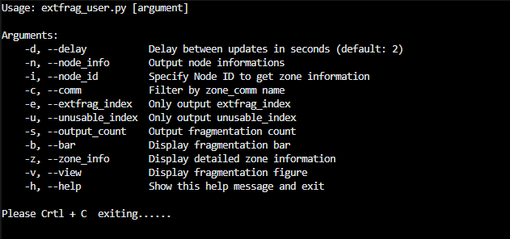
</div>


2.  View information under the UMA architecture:

- Use `sudo ./extfrag_user.py -n` to view node information.


<div align=center>
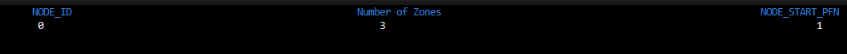
</div>


- Use `sudo ./extfrag_user.py -z -d 2 `to view detailed information about all zones.

<div align=center>

</div>

- Use `sudo ./extfrag_user.py` to view fragmentation information of all zones within the node.

<div align=center>
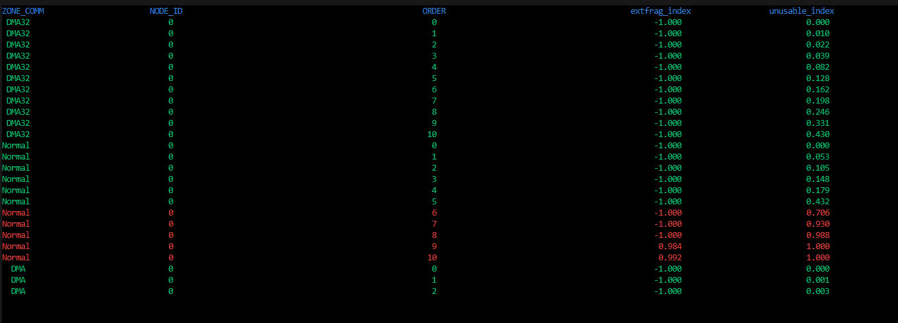
</div>

- Use `sudo ./extfrag_user.py -b` to display the fragmentation index.

<div align=center>
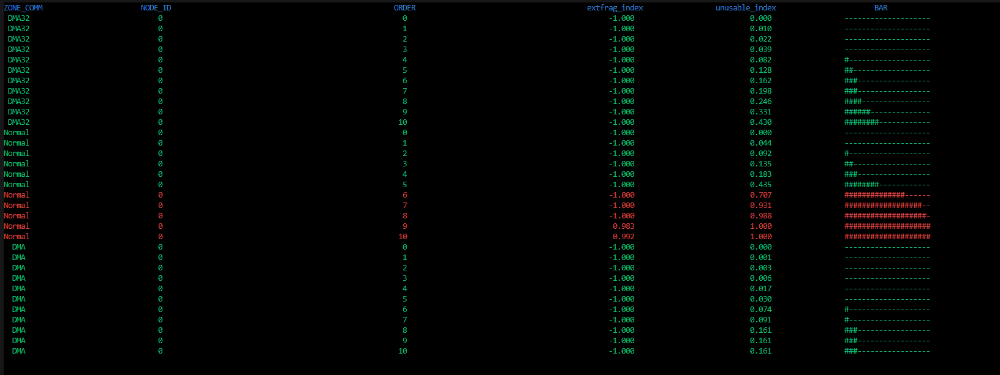
</div>

- Use `sudo ./extfrag_user.py -v` to visualize the fragmentation information of all zones under the UMA architecture.

<div align=center>
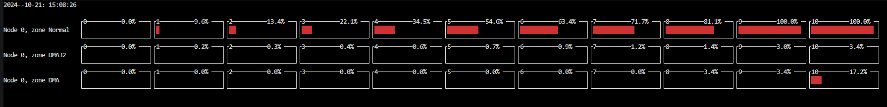
</div>

3.  View information under the NUMA architecture:

- Use `sudo ./extfrag_user.py -n `to view node information.

<div align=center>
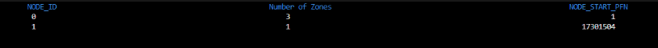
</div>


- Use `sudo ./extfrag_user.py -z -d 2` to view detailed information about all zones.

<div align=center>

</div>

- Use `sudo ./extfrag_user.py` to view fragmentation information of all zones within the node.

<div align=center>
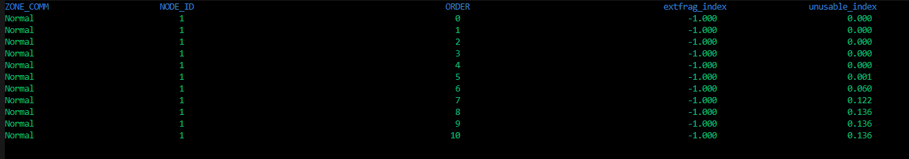
</div>

- Use `sudo ./extfrag_user.py -d 2 -c Normal` to view the fragmentation information of the memory zone named "Normal."

<div align=center>
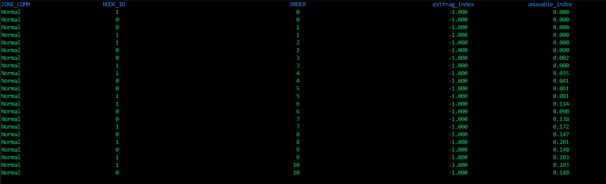
</div>

- Use `sudo ./extfrag_user.py -b` to display the fragmentation index.

<div align=center>

</div>

- Use `sudo ./extfrag_user.py -v` to visualize the fragmentation information of all zones under the NUMA architecture.
<div align=center>

</div>

4. Use 'sudo./extfrag_user.py -s' to view the details of the process that has external fragmentation in the system and the number of external fragmentation cases.
<div align=center>
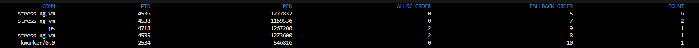
</div>

# Test method
## Test tools
The memory fragmentation monitoring tool primarily monitors the fragmentation levels of different orders within each zone. We will use `stress-ng` for load testing to determine if our memory fragmentation tool can dynamically adjust based on the collected zone information.

The `stress-ng too`l is installed by `sudo dnf install stress-ng`. The specific method of use [reference documentation](https://manpages.ubuntu.com/manpages/focal/man1/stress-ng.1.html), please.

## Specific test method
After restarting the system, run the memory fragmentation monitoring tool on the first terminal, and re-open one terminal to stress with stress-ng to see if the system's memory fragmentation increases.
## Test effect
### UMA Architecture Testing

- In Terminal 1, run `sudo ./extfrag_user.py -v` to check the memory fragmentation level before the load test.
<div align=center>

</div>

- Terminal 2 Run the `stress-ng --vm 5 --vm-bytes 3G` command to perform a stress test. Five processes occupy 3G memory


- After an interval of 20 seconds, run `sudo ./extfrag_user.py -v` to check the memory fragmentation level after the load test.
<div align=center>
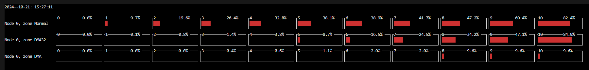
</div>


### NUMA Architecture Testing

- In Terminal 1, run `sudo ./extfrag_user.py -v` to check the memory fragmentation level before the load test.
<div align=center>

</div>

- Terminal 2 Run the `stress-ng --vm 5 --vm-bytes 5G` command to perform a stress test. Five processes occupy 5G memory


- After an interval of 40 seconds, run` sudo ./extfrag_user.py -v`to check the memory fragmentation level after the load test.

<div align=center>
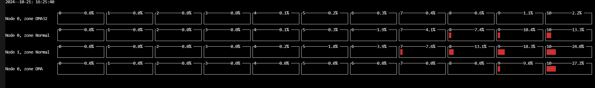
</div>

From the results above, we can see that after applying pressure, the memory fragmentation level increases.

# Contribution
1.Fork the repository

2.Create Feat_xxx branch

3.Commit your code

4.Create Pull Request

# Gitee Feature
1.You can use Readme\_XXX.md to support different languages, such as Readme\_en.md, Readme\_zh.md

2.Gitee blog blog.gitee.com

3.Explore open source project https://gitee.com/explore

4.The most valuable open source project [GVP](https://gitee.com/gvp)

5.The manual of Gitee https://gitee.com/help

6.The most popular members https://gitee.com/gitee-stars/
