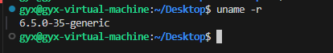
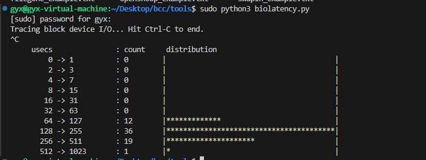

# PilotGo-plugin-MFD

## 项目名称
Linux系统物理内存碎片可视化监控工具

## 项目描述
本项目主要开发一款Linux系统物理内存碎片可视化监控工具，用于对当前运行系统中物理内存碎片化程度进行可视化监控和记录。
本项目主要实现的功能有：

- 定时收集当前系统环境中物理内存碎片化程度信息，定时时间可配置；

- 记录内存碎片化数据信息；

- 使用一种可视化工具对当前收集的物理内存碎片化信息进行直观展示。

## 开发技术
 - 内核态：eBPF
 - 用户态：Python

 这里主要是基于[BCC](https://github.com/iovisor/bcc)进行开发，在内核态使用 eBPF ，用户态使用 Python进行开发


## BCC环境配置

本项目基于BCC进行开发，因此需要安装BCC环境，[参考文档](https://github.com/iovisor/bcc/blob/master/INSTALL.md)，在这里我采用源码安装的方式

### 使用环境
一般来说，要使用这些功能，需要 Linux 内核版本 4.1 或更高版本，内核版本通过`uname -r`来查看

<div align=center>

</div>

- OS : Ubuntu 22.04
- Kernel: Linux 6.5

### 更新系统包

```
sudo apt update
```
###  安装构建依赖项

这里根据自己的ubuntu版本来选择
```
# For Focal (20.04.1 LTS)
sudo apt install -y zip bison build-essential cmake flex git libedit-dev \
  libllvm12 llvm-12-dev libclang-12-dev python zlib1g-dev libelf-dev libfl-dev python3-setuptools \
  liblzma-dev arping netperf iperf

# For Hirsute (21.04) or Impish (21.10)
sudo apt install -y zip bison build-essential cmake flex git libedit-dev \
  libllvm12 llvm-12-dev libclang-12-dev python3 zlib1g-dev libelf-dev libfl-dev python3-setuptools \
  liblzma-dev arping netperf iperf

# For Jammy (22.04)
sudo apt install -y zip bison build-essential cmake flex git libedit-dev \
  libllvm14 llvm-14-dev libclang-14-dev python3 zlib1g-dev libelf-dev libfl-dev python3-setuptools \
  liblzma-dev libdebuginfod-dev arping netperf iperf
  
# For Lunar Lobster (23.04)
sudo apt install -y zip bison build-essential cmake flex git libedit-dev \
  libllvm15 llvm-15-dev libclang-15-dev python3 zlib1g-dev libelf-dev libfl-dev python3-setuptools \
  liblzma-dev libdebuginfod-dev arping netperf iperf libpolly-15-dev

# For Mantic Minotaur (23.10)
sudo apt install -y zip bison build-essential cmake flex git libedit-dev \
  libllvm16 llvm-16-dev libclang-16-dev python3 zlib1g-dev libelf-dev libfl-dev python3-setuptools \
  liblzma-dev libdebuginfod-dev arping netperf iperf libpolly-16-dev

# For other versions
sudo apt-get -y install zip bison build-essential cmake flex git libedit-dev \
  libllvm3.7 llvm-3.7-dev libclang-3.7-dev python zlib1g-dev libelf-dev python3-setuptools \
  liblzma-dev arping netperf iperf

# For Lua support
sudo apt-get -y install luajit luajit-5.1-dev
```

### 安装并编译BCC


```
git clone https://github.com/iovisor/bcc.git
mkdir bcc/build; cd bcc/build
cmake ..
make
sudo make install
cmake -DPYTHON_CMD=python3 .. # build python3 binding
pushd src/python/
make
sudo make install
popd
```
### 常见问题
 `No module named 'setuptools'`
 
解决办法：python默认是没有安装setuptools这个模块的，进行安装 `sudo apt-get install
python3-setuptools`
### 测试是否安装成功

```
cd bcc/tools
ls
```
执行ls会发现有很多python文件，执行`sudo python3 biolatency.py`

<div align=center>

</div>

此时则代表环境配置成功

#### 使用说明

1.  xxxx
2.  xxxx
3.  xxxx

#### 参与贡献

1.  Fork 本仓库
2.  新建 Feat_xxx 分支
3.  提交代码
4.  新建 Pull Request


#### 特技

1.  使用 Readme\_XXX.md 来支持不同的语言，例如 Readme\_en.md, Readme\_zh.md
2.  Gitee 官方博客 [blog.gitee.com](https://blog.gitee.com)
3.  你可以 [https://gitee.com/explore](https://gitee.com/explore) 这个地址来了解 Gitee 上的优秀开源项目
4.  [GVP](https://gitee.com/gvp) 全称是 Gitee 最有价值开源项目，是综合评定出的优秀开源项目
5.  Gitee 官方提供的使用手册 [https://gitee.com/help](https://gitee.com/help)
6.  Gitee 封面人物是一档用来展示 Gitee 会员风采的栏目 [https://gitee.com/gitee-stars/](https://gitee.com/gitee-stars/)
