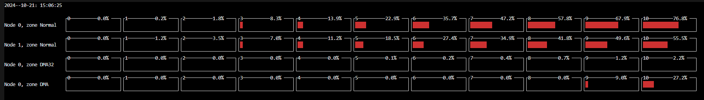
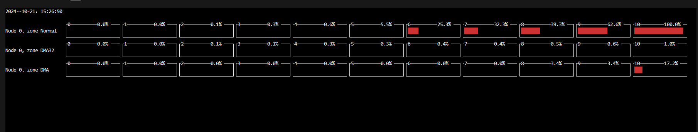
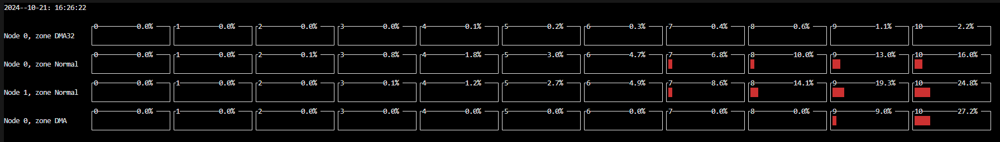

# PilotGo-plugin-MFD

## 项目简介

### 项目名称

Linux系统物理内存碎片可视化监控工具

### 项目描述

本项目主要开发一款Linux系统物理内存碎片可视化监控工具，用于对当前运行系统中物理内存碎片化程度进行可视化监控和记录。
本项目主要实现的功能有：

- 定时收集当前系统环境中物理内存碎片化程度信息，定时时间可配置；

- 记录内存碎片化数据信息；

- 使用一种可视化工具对当前收集的物理内存碎片化信息进行直观展示。

### 项目开发技术

 - 内核态：eBPF
 - 用户态：Python

 这里主要是基于[BCC](https://github.com/iovisor/bcc)进行开发，在内核态使用 eBPF ，用户态使用 Python进行开发。


# BCC环境配置

本项目基于BCC进行开发，因此需要安装BCC环境，[参考文档](https://github.com/iovisor/bcc/blob/master/INSTALL.md)，这里介绍一下在Ubuntu下和 openeuler下配置 BCC 的环境。

## Ubuntu 系统

一般来说，要使用这些功能，需要 Linux 内核版本 4.1 或更高版本，内核版本通过`uname -r`来查看

<div align=center>

</div>


- OS : Ubuntu 22.04
- Kernel: Linux 6.5

### 更新系统包

```
sudo apt update
```

###  安装构建依赖项

这里根据自己的ubuntu版本来选择

```
# For Focal (20.04.1 LTS)
sudo apt install -y zip bison build-essential cmake flex git libedit-dev \
  libllvm12 llvm-12-dev libclang-12-dev python zlib1g-dev libelf-dev libfl-dev python3-setuptools \
  liblzma-dev arping netperf iperf

# For Hirsute (21.04) or Impish (21.10)
sudo apt install -y zip bison build-essential cmake flex git libedit-dev \
  libllvm12 llvm-12-dev libclang-12-dev python3 zlib1g-dev libelf-dev libfl-dev python3-setuptools \
  liblzma-dev arping netperf iperf

# For Jammy (22.04)
sudo apt install -y zip bison build-essential cmake flex git libedit-dev \
  libllvm14 llvm-14-dev libclang-14-dev python3 zlib1g-dev libelf-dev libfl-dev python3-setuptools \
  liblzma-dev libdebuginfod-dev arping netperf iperf
  
# For Lunar Lobster (23.04)
sudo apt install -y zip bison build-essential cmake flex git libedit-dev \
  libllvm15 llvm-15-dev libclang-15-dev python3 zlib1g-dev libelf-dev libfl-dev python3-setuptools \
  liblzma-dev libdebuginfod-dev arping netperf iperf libpolly-15-dev

# For Mantic Minotaur (23.10)
sudo apt install -y zip bison build-essential cmake flex git libedit-dev \
  libllvm16 llvm-16-dev libclang-16-dev python3 zlib1g-dev libelf-dev libfl-dev python3-setuptools \
  liblzma-dev libdebuginfod-dev arping netperf iperf libpolly-16-dev

# For other versions
sudo apt-get -y install zip bison build-essential cmake flex git libedit-dev \
  libllvm3.7 llvm-3.7-dev libclang-3.7-dev python zlib1g-dev libelf-dev python3-setuptools \
  liblzma-dev arping netperf iperf

# For Lua support
sudo apt-get -y install luajit luajit-5.1-dev
```

### 安装并编译BCC


```
git clone https://github.com/iovisor/bcc.git
mkdir bcc/build; cd bcc/build
cmake ..
make
sudo make install
cmake -DPYTHON_CMD=python3 .. # build python3 binding
pushd src/python/
make
sudo make install
popd
```

### 常见问题

 `No module named 'setuptools'`

解决办法：python默认是没有安装setuptools这个模块的，进行安装 `sudo apt-get install
python3-setuptools`

### 测试是否安装成功

```
cd bcc/tools
ls
```

执行`ls`会发现有很多python文件，执行`sudo python3 biolatency.py`

<div align=center>

</div>


此时则代表环境配置成功
## openEuler 系统

### 预先安装的软件包
在安装 openEuler 系统时，我们最好勾选“ 软件选择 ==> 已选环境的附加软件 ==> 开发工具”，这样会免去安装很多开发工具，例如 git、python3 等

**如果没有勾选，我们可以通过以下命令安装相应的开发工具：**

```
sudo  dnf install git -y
sudo dnf update
sudo dnf install python3 python3-pip
```
### bcc环境配置

一般来说，要使用这些功能，需要 Linux 内核版本 4.1 或更高版本，内核版本通过`uname -r`来查看

<div align=center>

</div>


- OS : openeuler 23.04
- Kernel: Linux 6.6

### 更新并安装软件包

执行命令
```
sudo dnf update
sudo dnf install bcc
```
通过这两条命令更新软件包并会自动安装 bcc开发的相关环境及工具，例如`bpf-tools、python3-bpfcc、llvm-libs、clang-libs`等。

<div align=center>

</div>

<div align=center>

</div>


### 报错记录
安装完成之后，我们进入到默认的安装目录`/usr/share/bcc`中，可以看到有个文件夹`tools`。

通过`cd /usr/share/bcc/tools`进入该文件夹下，使用sudo运行一个二进制文件结果如下报错，我们需要去执行`sudo dnf install kernel-devel-$(uname -r)`安装当前运行内核版本的开发包即可解决。

<div align=center>

</div>

再次执行`sudo  ./execsnoop`,终端输出数据，如下图，说明bcc环境通过软件包的形式配置好了

<div align=center>

</div>

# 使用说明
## 克隆仓库
在openeuler环境下和Ubuntu环境下类似，这里介绍的是openeuler环境下如何使用内存碎片化工具。

通过`git clone git@gitee.com:gyxforeveryoung/PilotGo-plugin-MFD.git`克隆项目代码到本地，进入到PilotGo-plugin-MFD文件夹中。


## 代码架构

```
.
├── img
├── README.en.md
├── README.md
└── src
    ├── bpf
    │   ├── extfraginfo.c
    │   └── fraginfo.c
    ├── extfrag.py
    ├── extfrag_user.py
    └── __pycache__
        └── extfrag.cpython-311.pyc
```

- `extfrag.py` 文件，用于实现提取相应格式的数据函数

- `extfrag_user.py` 文件，用于实现命令行接口

- `extfraginfo.c`实现监测外碎片化事件

- `fraginfo.c` 统计系统中所有内存节点中的所有 `zone` 对于不同 `order` 的碎片化程度


采集的碎片化程度信息如下：

- ZONE_COMM ：表示`zone`的名称，有DMA/NORMAL/DMA32等
- ZONE_PFN ：表示该内存区域从哪一个物理页框号开始。
- SUM_PAGES : 此区域内的总页数，指内存区域总共包含的物理内存页数。
- FACT_PAGES : 此区域实际使用中的页数
- ORDER ：表示页块的大小
- TOTAL ：该区域内空闲块的总数
- SUITABLE ：适合当前分配请求的空闲块数
- FREE：该区域内空闲页的总数
- NODE_ID ：表示内存节点的标识符
- extfrag_index ：表示内核中 `extfrag_index` 指数
- unusable_index ：表示内核中的 ` unusable_index `指数


采集的节点信息如下：

- NODE_ID：表示内存节点的标识符
- Number of Zones：节点中的区域个数
- NODE_START_PFN：节点的 `pgdat` 的起始页帧号

采集的外碎片化事件信息如下：
- COMM：发生外碎片化事件的进程名
- PID：发生外碎片化事件的进程号
- PFN：表示实际分配的物理页的页帧号
- ALLOC_ORDER：初始分配内存的阶数
- FALLBACK_ORDER：在分配请求无法满足时，实际分配到的内存块的阶数
- COUNT：发生外碎片化事件的次数
## 错误信息
运行`sudo python3 ./extfrag_user.py`之后，遇到如下报错：

<div align=center>

</div>

这个错误，我们需要去`extfrag.py`代码中修改：
- 在Ubuntu中，我们使用源码进行编译，配置bcc环境，因此`extfrag.py`使用`from bpf import BPF`导入bpf
- 在openeuler中，我们使用软件包配置bcc环境，因此`extfrag.py`使用`from bpfcc import BPF`导入bpf


**避免每次都要显式使用 `python` 命令来运行脚本，你可以为脚本添加一个 shebang 行，然后确保脚本具有可执行权限**。

- 给`extfrag_user.py`  和`extfrag.py`添加一个 shebang 行`#!/usr/bin/env python3`
- 为脚本添加可执行权限

```
chmod +x extfrag_user.py
chmod +x extfrag.py
```

现在可以使用`sudo ./extfrag_user.py`来直接运行脚本

## 运行环境

- 在UMA架构的测试环境下，系统是一台3.3GB内存的虚拟机，系统有1个内存节点（Node0），其中包含3个内存区域。
- 在NUMA架构的测试环境中，系统是一台拥有128GB内存的服务器，系统有2个内存节点，Node0包含3个内存区域，Node1包含1个内存区域。

## 使用步骤

1.  使用`sudo ./extfrag_user.py -h`查看帮助函数

<div align=center>

</div>


2.  查看UMA架构下的信息

- 使用`sudo ./extfrag_user.py -n`查看node节点的信息

<div align=center>

</div>


- 使用`sudo ./extfrag_user.py -z -d 2`查看所有区域的详细信息

<div align=center>

</div>

- 使用`sudo ./extfrag_user.py `查看 node节点的所有区域内存碎片化程度信息

<div align=center>

</div>

- 使用`sudo ./extfrag_user.py -b`进行展示碎片化指数

<div align=center>

</div>

- 使用`sudo ./extfrag_user.py -v`可视化UMA架构下的所有区域的碎片化程度信息

<div align=center>

</div>

3.  查看NUMA架构下的信息

- 使用`sudo ./extfrag_user.py -n`查看node节点的信息

<div align=center>

</div>


- 使用`sudo ./extfrag_user.py -z -d 2`查看所有区域的详细信息

<div align=center>

</div>

- 使用`sudo ./extfrag_user.py -d 2 -i 1`仅查看node_id=1的内存碎片化程度信息
<div align=center>

</div>


- 使用`sudo ./extfrag_user.py -d 2 -c Normal`仅查看zone名称为 Normal 的内存碎片化程度信息

<div align=center>

</div>

- 使用`sudo ./extfrag_user.py -b`展示碎片化程度

<div align=center>

</div>

- 使用`sudo ./extfrag_user.py -v`可视化NUMA架构下的所有区域的碎片化程度信息

<div align=center>

</div>

4.  使用`sudo ./extfrag_user.py -s`查看系统中发生外碎片化的进程的详细信息以及发生外碎片化的次数

<div align=center>

</div>

# 测试方法

## 测试工具
内存碎片化监测工具，监测的主要是每个zone当中对于不同的order的内存碎片化程度，我们这里使用stress-ng加压测试，来判断我们的内存碎片化工具是否能够根据采集到zone的信息去**动态**改变

stress-ng工具通过`sudo dnf install stress-ng`安装，具体使用方法请[参考文档](https://manpages.ubuntu.com/manpages/focal/man1/stress-ng.1.html)。


## 具体测试方法
重启系统后，在第一个终端运行内存碎片化监测工具，重新开启一个终端使用 stress-ng 进行加压，来观察系统的内存碎片化程度是否会增加。
## 测试效果
### UMA架构下测试

- 终端1运行`sudo ./extfrag_user.py -v `查看压测前的内存碎片化程度 
<div align=center>

</div>

- 终端2执行命令`stress-ng --vm 5 --vm-bytes 3G`进行加压测试，使用 5 个进程占用 3G 内存


- 间隔20s，运行`sudo ./extfrag_user.py -v `查看压测后的内存碎片化程度
<div align=center>

</div>


### NUMA架构下测试

- 终端1运行`sudo ./extfrag_user.py -v `查看压测前的内存碎片化程度 
<div align=center>

</div>

- 终端2执行命令`stress-ng --vm 5 --vm-bytes 5G`进行加压测试，使用 5 个进程占用 5G 内存


- 间隔40s，运行`sudo ./extfrag_user.py -v `查看压测后的内存碎片化程度
<div align=center>

</div>

通过对于加压前后对比系统内的内存碎片化结果，我们可以看出，在加压后，内存碎片化程度会显著增加。
# 参与贡献

1.  Fork 本仓库
2.  新建 Feat_xxx 分支
3.  提交代码
4.  新建 Pull Request


# 特技

1.  使用 Readme\_XXX.md 来支持不同的语言，例如 Readme\_en.md, Readme\_zh.md
2.  Gitee 官方博客 [blog.gitee.com](https://blog.gitee.com)
3.  你可以 [https://gitee.com/explore](https://gitee.com/explore) 这个地址来了解 Gitee 上的优秀开源项目
4.  [GVP](https://gitee.com/gvp) 全称是 Gitee 最有价值开源项目，是综合评定出的优秀开源项目
5.  Gitee 官方提供的使用手册 [https://gitee.com/help](https://gitee.com/help)
6.  Gitee 封面人物是一档用来展示 Gitee 会员风采的栏目 [https://gitee.com/gitee-stars/](https://gitee.com/gitee-stars/)